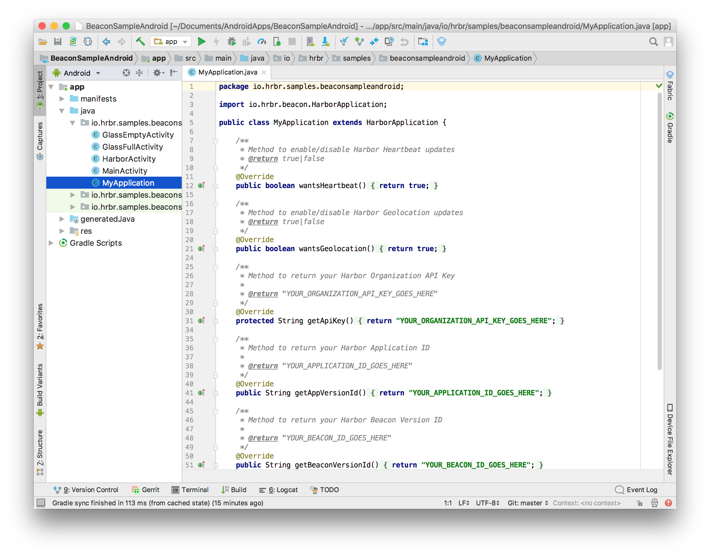
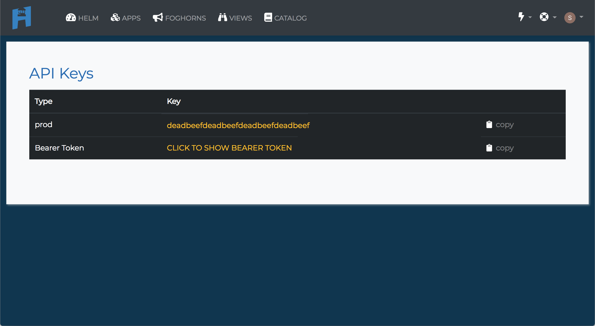
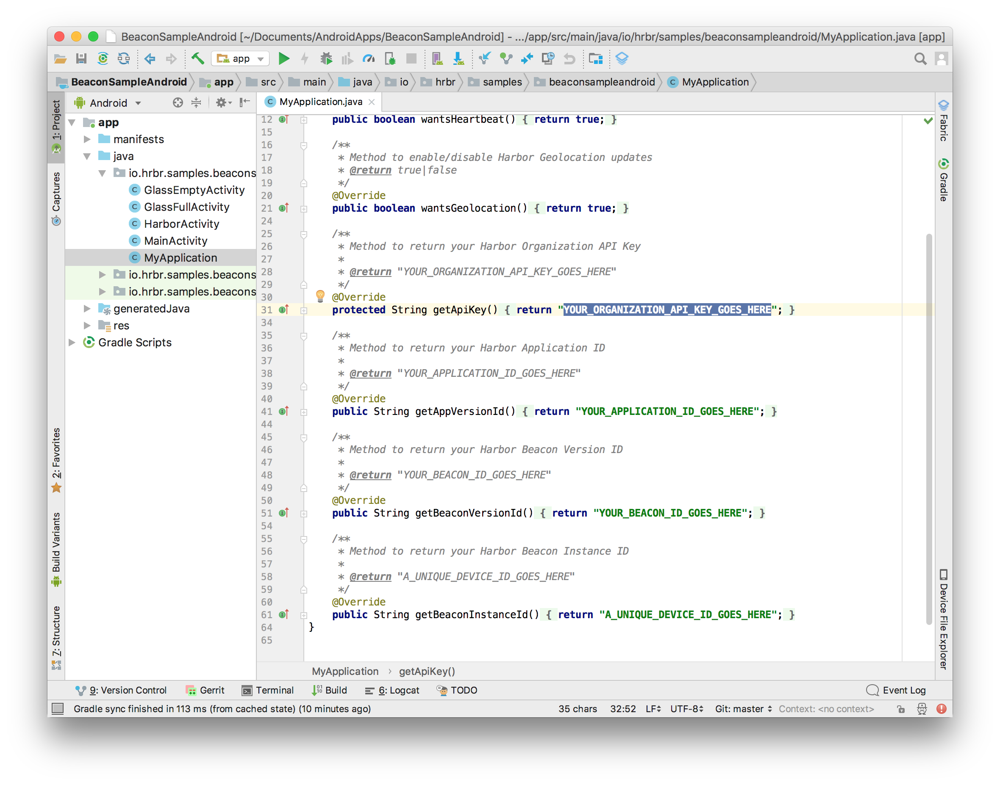
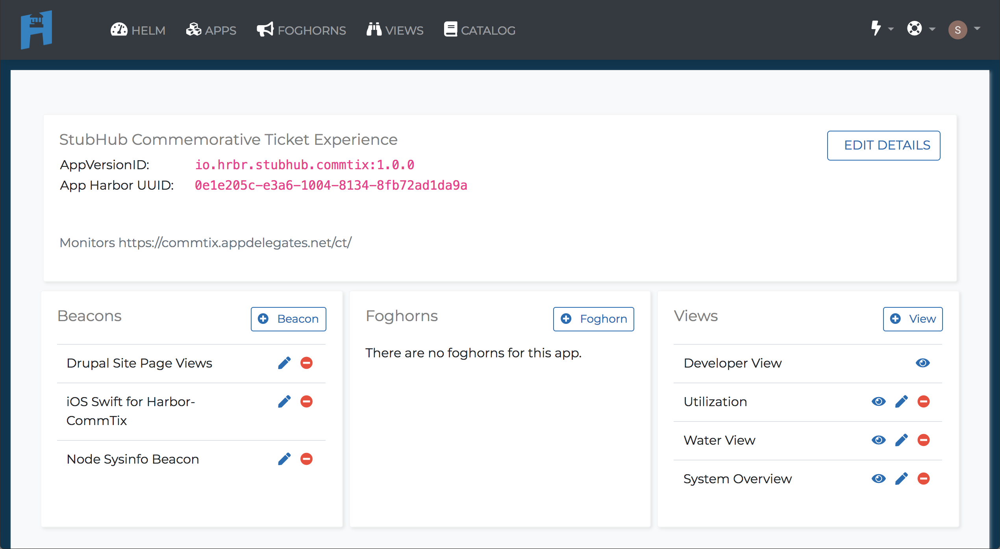
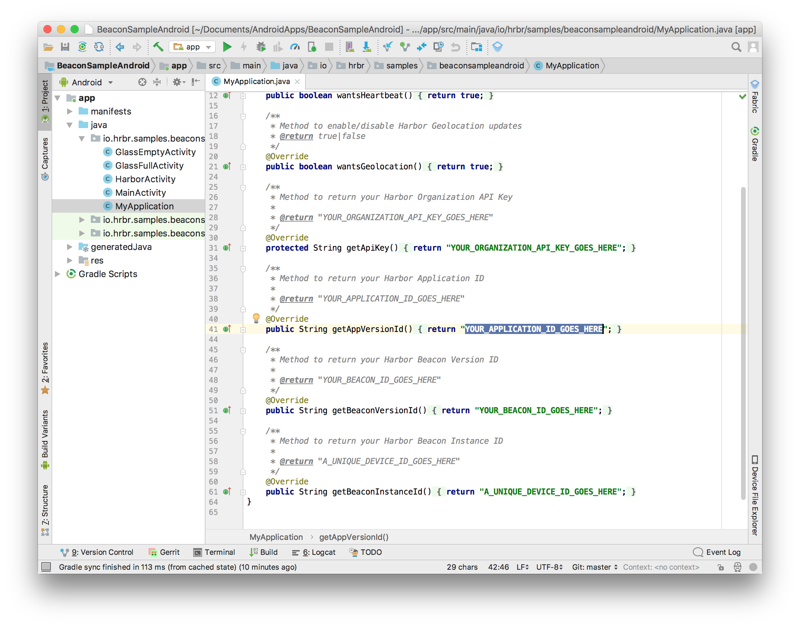
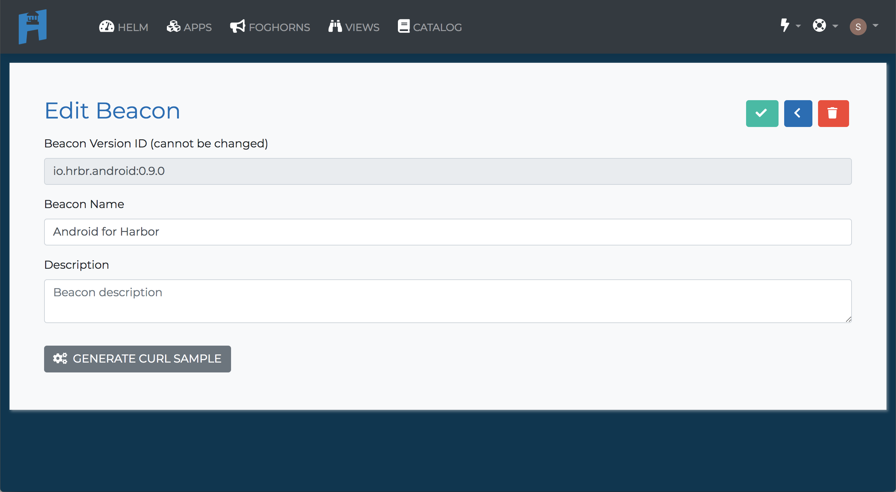
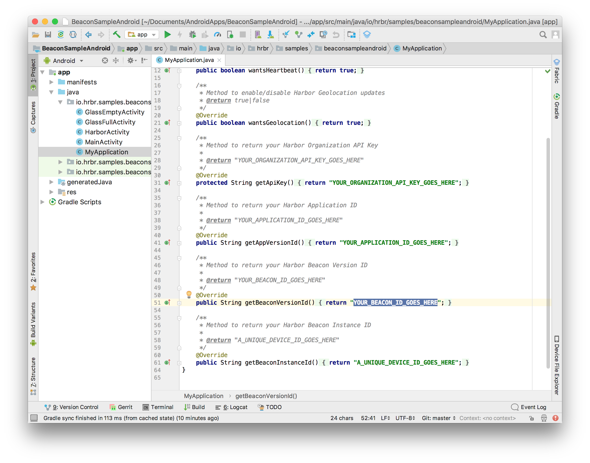
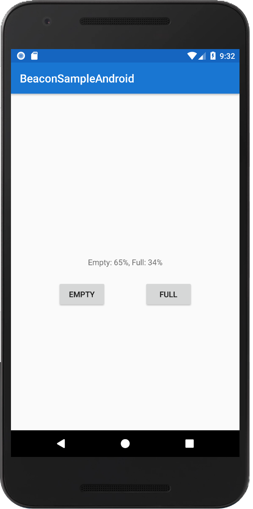
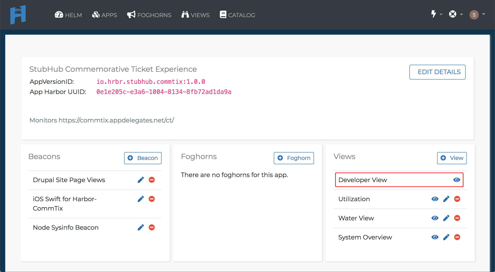

# BeaconSampleAndroid

Getting started with Harbor Beacon on Android:

- [Setup](#setup) - Get setup
- [Beacon Sample](#BeaconSample) - Run the Beacon Sample app

## Setup

This project uses/requires:
 - Android Studio
 - SDK Version API 23: Android 6.0 (Marshmallow)
 - Google Play Services
 - Maven/JitPack

If you haven't used Harbor before, welcome! You'll need to [Sign up for a Harbor account](https://www.hrbr.io/try-hrbr) first.

### JitPack 

1. Install [JitPack](https://jitpack.io/#HrbrIO/HarborAndroidBeacon/0.2.1). 

## BeaconSample

### Running the Beacon Sample

To get started with the Quickstart application follow these steps:

1. Open this `BeaconSampleAndroid` in Android Studio

2. Copy your organization API Key from the [API Keys page](https://cloud.hrbr.io/#!/account/apikeys).

3. Paste your organization API Key from the earlier step in the `MyApplication.java`.

4. Copy your **AppVersionID** from the specific [Applications page](https://cloud.hrbr.io/#!/apps/list).

5. Paste your **AppVersionID** in the `MyApplication.java`.

6. Copy your **Beacon Version ID** from the specific [Edit Beacon page](https://cloud.hrbr.io/#!/apps/list) for the Beacons for your Application.

7. Paste your **Beacon Version ID** in the `MyApplication.java`.

8. Run the Beacon Sample app on your Android device or simulator.

9. Once you have your app running, you should beacons on the [Developer View page](https://cloud.hrbr.io/#!/apps/list) for your Application.!

### Beacon Messages

|Message Type|Message Data|Description|
|---|---|---|
|APP_START_MSG|N/A||
|APP_BG_MSG|N/A||
|APP_FG_MSG|N/A||
|APP_KILL_MSG|N/A||
|HEARTBEAT|N/A||
|SCREEN_VIEW|`{  "screen" : screenName } `||
|SCREEN_DWELL|`{ "screen": screenName, "time" : timeIntervalSince1970 }`||
|GEOLOCATION|`{ "latitude" : latitude, "longitude" : longitude, "altitude" : altitudeMeters, "hz_accuracy" : horizontalAccuracyMeters, "vrt_accuracy" : verticalAccuracyMeters `||

### Beacon Functions

* `mHarborLogger.appStart()`
* `mHarborLogger.appBackground()`
* `mHarborLogger.appForeground()`
* `mHarborLogger.appKill()`
* `mHarborLogger.startHeartbeat()`
* `mHarborLogger.stopHeartbeat()`
* `mHarborLogger.logLocation(location)`
* `mHarborLogger.startScreenDwell(viewName)`
* `mHarborLogger.stopScreenDwell(viewName)`

## License

This project is licensed under the [Apache License, Version 2.0](https://github.com/HrbrIO/BeaconSampleAndroid/blob/master/LICENSE)
